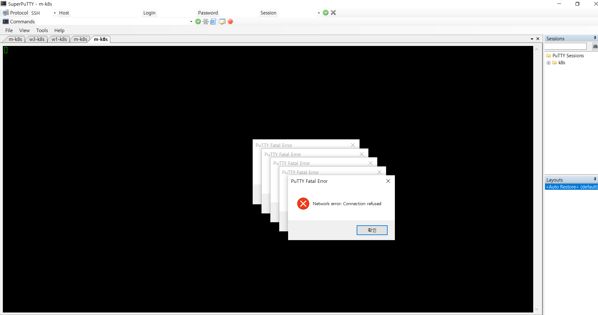
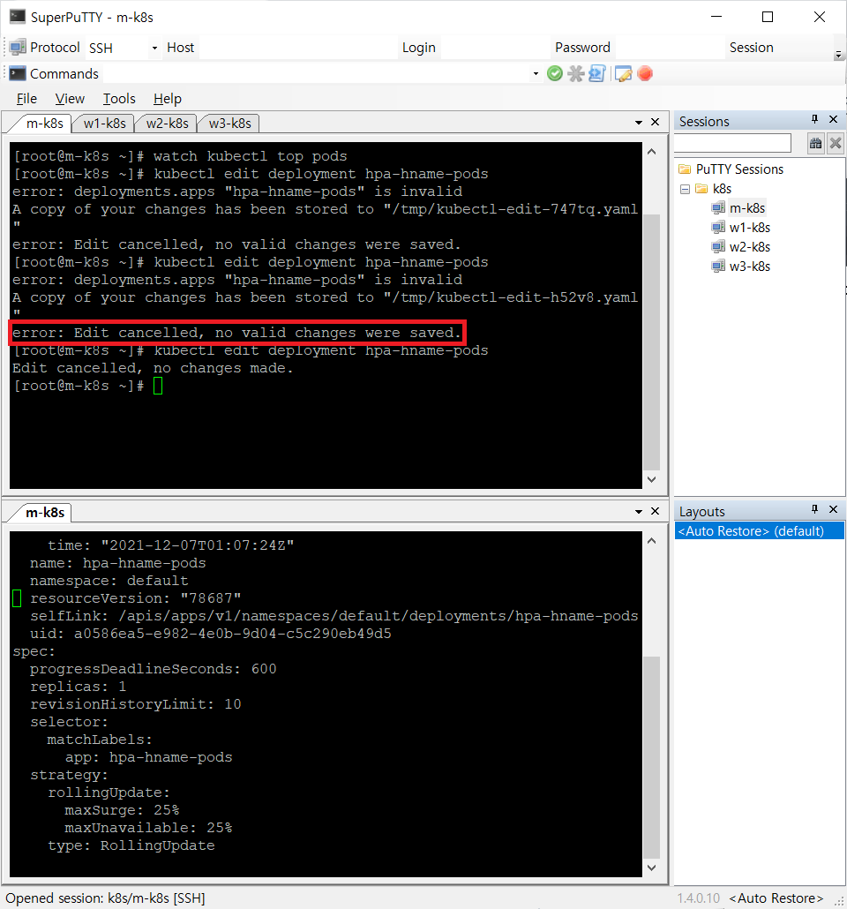

# Putty Fatal Error: Network Error Connection Refused

호스트 운영체제를 재부팅하고, Putty로 게스트 운영체제에 접속할 때 발생하는 오류다.

Vagrant 프로비저닝을 사용하기 때문에, vagrant reload 명령어를 사용하여 해결하였다.

## Reference 
- [Vagrant Reload](https://www.vagrantup.com/docs/cli/reload)

# Error: Edit cancelled, no valid changes were saved.

174페이지에서 HPA 실습 중 kubectl edit deployment hpa-hname-pods 명령어를 

실행하여 deployment의 내용을 수정했는데 위 그림과 같은 오류가 발생했다.

편집이 취소된 걸로 봐서 혹시나 들여쓰기나 오타가 있는지 확인했고 다시 수정한 결과 

문제가 해결되었다.