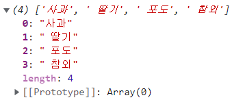

# 바닐라 자바스크립트 기초

## 자바스크립트 원시 타입

프로그래밍 언어에서 값의 종류를 데이터 타입, 자료형등으로 불립니다.

자바스크립트에서도 값의 종류를 **원시 타입(primitive type)** 이라 부르며

**숫자, 문자열, 불리언, null, undefined, 심볼**이 있습니다.

다음은 값의 타입을 확인하기 위해서 **typeof 연산자**를 사용하는 코드입니다.

```
// typeof
const MAX_SIZE = 12;
let str = "Vanila Javascript";
let isClosed = true;
let currentValue = null;
let n;                              // 초기화하지 않으면 undefined 할당
const RED = Symbol("apple");

console.log(typeof MAX_SIZE);       // number
console.log(typeof str);            // string
console.log(typeof isClosed);       // boolean
console.log(typeof currentValue);   // object
console.log(typeof n);              // undefined
console.log(typeof RED);            // symbol
```

## 템플릿 문법

**템플릿 문법(backtick)** 은 변수나 상수를 문자열과 결합하는 방법입니다.

템플릿 문법 이전에는 문자열과 변수[상수]를 + 연산자로 결합하였습니다.

```
let name = "Kim";
let age = 15;

const message = "저는 "+name+"이고, 나이는 "+age+"입니다.";
console.log(message);
```

템플릿 문법은 문자열 안에 변수나 상수를 기입하는 방식이며, 백틱(``)을 사용합니다.

```
let location = "Seoul";
let temperature = -1;

const message = `오늘 ${location}은 기온 ${temperature}입니다.`;
console.log(message);
```

## 문자열 조작

문자열은 자바스크립트의 내장 객체인 String 타입이며 문자열을 조작하기 위한 다양한 함수들을 제공합니다.

여기서 살펴볼 문자열 조작 함수는 **substring**과 **split** 함수입니다.

```
// substring
const fullName = "HongGildong";
console.log(`Typeof: ${typeof fullName}`);
console.log(`풀네임(Full Name): ${fullName}`);
console.log(`성(Last Name): ${fullName.substring(0, 4)}`);
console.log(`이름(First Name): ${fullName.substring(5)}`);
```

**substring 함수**는 **시작 인덱스(startIdx) 값**과 **끝 인덱스(endIdx) 값**을 주면, startIdx부터 시작해서 (endIdx-1)까지의 문자열을 반환합니다.

```
// split
let fruits = "사과, 딸기, 포도, 참외";
fruits = fruits.split(", ");
console.log(fruits);
```

**split 함수**는 단어 그대로, 구분자(separator)를 기준으로 문자열을 나눕니다. 위 코드에서 구분자인 ", "를 기준으로 "사과", "딸기", "포도", "참외"를 배열로 반환합니다.



## 레퍼런스

- String.prototype.split(), 「https://developer.mozilla.org/en-US/docs/Web/JavaScript/Reference/Global_Objects/String/split」
