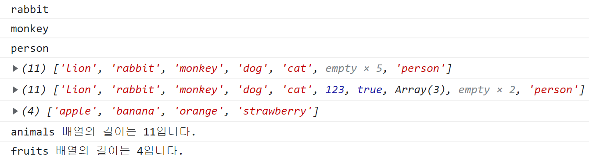

# 배열

배열은 프로그래밍에서 데이터 집합을 생성할 때 가장 많이 사용되는 문법입니다.

수업을 듣고 자바스크립트 배열의 내용을 추가적으로 정리해 보았습니다.

## 배열 선언 및 접근

```
// 대괄호를 사용해서 배열 생성
const animals = ["lion", "rabbit", "monkey", "dog", "cat"];

console.log(animals[1]);
console.log(animals[2]);

// 인덱스 값을 벗어난 범위에 데이터를 집어넣어 보았다.
animals[10] = "person";
console.log(animals[10]);
console.log(animals);

// 문자열이 아닌 다른 데이터 타입의 값도 넣어 보았다.
animals[5] = 123;
animals[6] = true;
animals[7] = [1, 2, 3];
console.log(animals);

// Array 생성자로 배열 생성
const fruits = new Array("apple", "banana", "orange", "strawberry");
console.log(fruits);

// 배열의 길이 출력
console.log(`animals 배열의 길이는 ${animals.length}입니다.`);
console.log(`fruits 배열의 길이는 ${fruits.length}입니다.`);
```



## 배열의 특징 정리

- 배열을 생성하고 요소에 접근하기 위해서 대괄호([])를 사용합니다.
- 배열의 길이를 벗어나는 인덱스 값에 요소를 할당하면 자동으로 배열의 길이가 늘어나고 빈 공간은 undefined가 할당됩니다.
- 배열의 각 요소는 서로 다른 데이터 타입을 허용합니다.
- Array 생성자로도 배열을 생성할 수 있습니다.

## 배열 메소드

앞에서 문자열을 처리하기 위해 substring 메소드와 split 메소드를 사용한 것처럼

배열에서도 배열을 조작하기 위해 여러 가지 메소드를 제공합니다.

### 데이터 삽입 메소드

배열은 대괄호의 인덱스 값을 사용해서 데이터를 삽입할 수 있습니다.
배열에서 기본적으로 제공하는 push, unshift 메소드를 사용해서 데이터를 사용할 수 있습니다.

```
const animals = ["lion", "rabbit", "monkey", "dog", "cat"];

// push 메소드
animals.push("penguin");
animals.push("fish");
console.log(animals); // ['lion', 'rabbit', 'monkey', 'dog', 'cat', 'penguin', 'fish']

// unshift 메소드
animals.unshift("person");
animals.unshift("dolphin");
console.log(animals); // ['dolphin', 'person', 'lion', 'rabbit', 'monkey', 'dog', 'cat', 'penguin', 'fish']
```

- push 메소드는 배열의 끝에 데이터를 삽입합니다.
- unshift 메소드는 배열의 시작에 데이터를 삽입합니다.
- 두 메소드는 배열에 데이터를 삽입하고 늘어난 길이를 반환합니다.

### 데이터 삭제 메소드

배열은 요소를 삭제하기 위해서 pop, shift 메소드를 제공합니다.
두 메소드는 삭제한 요소를 반환합니다.

```
// pop 메소드
const animals = ["lion", "rabbit", "monkey", "dog", "cat"];

const animal = animals.pop();
console.log(animal); // cat
console.log(animals); // ['lion', 'rabbit', 'monkey', 'dog']
```

```
// IsArray 메소드
```

```
// IndexOf 메소드
```

```
// splice 메소드
```

```
// slice 메소드
const animals = ["lion", "rabbit", "monkey", "dog", "cat"];
const slicedAnimals = animals.slice(0, 2);

console.log(slicedAnimals);
```

# 오브젝트

## 오브젝트 선언

```
const monkey = {
  name: "kiki",
  age: 5,
  weight: 40,
  gender: "male",
  isCute: true,
  food: ["banana", "carrot", "potato"], // 배열
  home: {
    // 오브젝트 in 오브젝트
    location: "zoo",
    size: "big",
    price: 3000,
  },
};
```

## 오브젝트 조작

```

```

### const 오브젝트를 변경할 수 있는 이유...

오브젝트의 값은 변경해도 된지만 오브젝트 자체를 변경할 수 없다. 아래 코드처럼 const로 선언된 상수에 다른 오브젝트를 할당할 수 없다.

```

```

# JSON(Javascript Object Notation)

```
// stringify
```

```
// parse
```

## 특징

# 레퍼런스

- [JSON](https://en.wikipedia.org/wiki/JSON)
